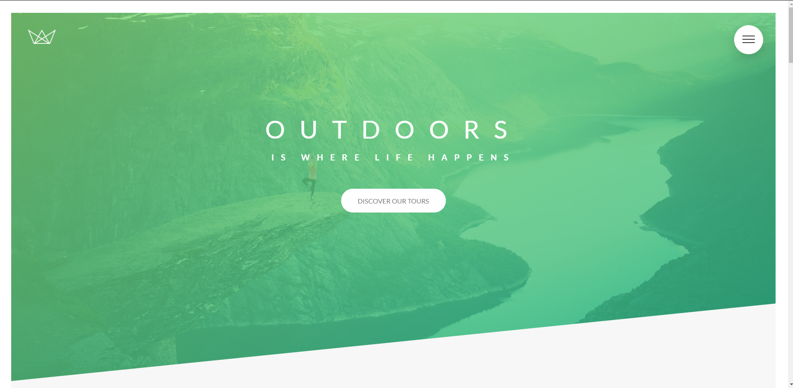

## Projeto-Natours

O projeto Natours foi desenvolvido no curso de CSS avançado, desenvolvido somente com html e css, mostrando que somente com essas duas tecnologias podemos fazer muita coisa sem a necessidade de javascript. O projeto também contempla arquitetura de css e metodologias como o BEM (Block Element Modifier).

[]

> ### Comandos

#### para baixar as dependências do projeto:
```
yarn
```

#### para compilar o sass:
```
yarn compile:sass
```

> ### Tecnologias utilizadas:
- HtML
- CSS
- SASS
- BEM
- NODEJS

> ### Estrutura:

    ├── node_modules  
    ├── css
      ├── fonts
    ├── img
    ├── sass
        ├── abstract
        ├── base
        ├── components
        ├── layout
        ├── pages
